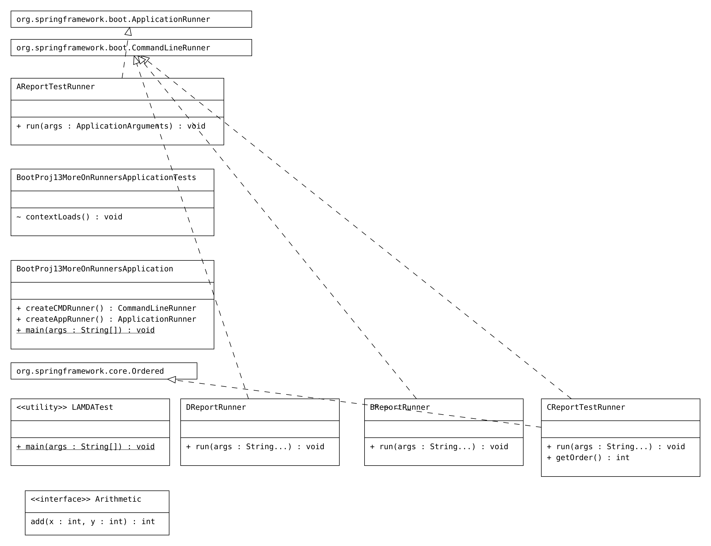

# BootProj13-MoreOnRunners

# Code
```Java
package com.nt.core;

interface Arithmetic{
	public int add(int x,int y);
}

public class LAMDATest {
	
	public static void main(String[] args) {
		  Arithmetic  ar1=(int a,int b)->{ int c=0;
		                                                               c=a+b;
		                                                               return c;
		                                                            };
		 System.out.println("result ::"+ar1.add(10, 20));
		   System.out.println("====================");
		            Arithmetic  ar2=(int a,int b)->{  return a+b;    };
                 System.out.println("result ::"+ar2.add(10, 20));
             System.out.println("====================");
		            Arithmetic  ar3=(int a,int b)->   a+b    ;
              System.out.println("result ::"+ar3.add(10, 20));
              System.out.println("====================");
	            Arithmetic  ar4=( a, b)->   a+b    ;
        System.out.println("result ::"+ar4.add(10, 20));
        System.out.println("====================");
        Arithmetic  ar5=( x, y)->   x+y    ;
       System.out.println("result ::"+ar5.add(10, 20));

              
       
	}

}
package com.nt.runners;

import java.util.List;
import java.util.Set;

import org.springframework.boot.ApplicationArguments;
import org.springframework.boot.ApplicationRunner;
import org.springframework.core.annotation.Order;
import org.springframework.stereotype.Component;

@Component
@Order(-1)
public class AReportTestRunner implements ApplicationRunner {

    @Override
    public void run(ApplicationArguments args) throws Exception {
        System.out.println("==ATestReportRunner :: run(-)===");
        List<String>  nonOptionArgs=args.getNonOptionArgs();
        System.out.println("Non Option args are::"+nonOptionArgs);

        Set<String>  optionArgs=args.getOptionNames();
        System.out.println("Option arg names and values::");
        for(String  name:optionArgs) {
            System.out.println(name+"===>"+args.getOptionValues(name));
        }


    }

}
package com.nt.runners;

import org.springframework.boot.CommandLineRunner;
import org.springframework.core.annotation.Order;
import org.springframework.stereotype.Component;

@Component
@Order(5)
public class BReportRunner implements CommandLineRunner {

    @Override
    public void run(String... args) throws Exception {
        System.out.println("BReportRunner.run()");

    }

}
package com.nt.runners;

import java.util.Arrays;

import org.springframework.boot.CommandLineRunner;
import org.springframework.core.Ordered;
import org.springframework.core.annotation.Order;
import org.springframework.stereotype.Component;

@Component
@Order(10)
public class CReportTestRunner implements CommandLineRunner,Ordered {

    @Override
    public void run(String... args) throws Exception {
        System.out.println("===CReport Test Runner --- run(-) method===");
        System.out.println("cmd line args::"+Arrays.toString(args));
        System.out.println("----------------------");
        for(String arg:args) {
            System.out.println(arg);
        }

    }

    @Override
    public int getOrder() {
        // TODO Auto-generated method stub
        return 0;
    }

}
package com.nt.runners;

import org.springframework.boot.CommandLineRunner;
import org.springframework.core.annotation.Order;
import org.springframework.stereotype.Component;

@Component
@Order(3)
public class DReportRunner implements CommandLineRunner {

    @Override
    public void run(String... args) throws Exception {
        System.out.println("DReportRunner.run()");

    }

}
package com.nt;

import org.springframework.boot.ApplicationRunner;
import org.springframework.boot.CommandLineRunner;
import org.springframework.boot.SpringApplication;
import org.springframework.boot.autoconfigure.SpringBootApplication;
import org.springframework.context.annotation.Bean;

@SpringBootApplication
public class BootProj13MoreOnRunnersApplication {


    @Bean
    public   CommandLineRunner  createCMDRunner() {
        System.out.println("BootProj13MoreOnRunnersApplication.createCMDRunner()");
        CommandLineRunner  cr1=(args )->{
            System.out.println("LAMDA Command Line Runner");
        };
        return cr1;
    }

    @Bean
    public   ApplicationRunner  createAppRunner() {
        System.out.println("BootProj13MoreOnRunnersApplication.createAppRunner()");
        ApplicationRunner  ar1=(args )->{
            System.out.println("LAMDA Application Line Runner");
        };
        return ar1;
    }


    public static void main(String[] args) {
        SpringApplication.run(BootProj13MoreOnRunnersApplication.class, args);
    }

}

```
# UML


# logs
```Java
BootProj13MoreOnRunnersApplication.createCMDRunner()
BootProj13MoreOnRunnersApplication.createAppRunner()
2024-05-22T10:48:06.851-04:00  INFO 86436 --- [BootProj13-MoreOnRunners] [           main] c.nt.BootProj13MoreOnRunnersApplication  : Started BootProj13MoreOnRunnersApplication in 0.789 seconds (process running for 1.052)
==ATestReportRunner :: run(-)===
Non Option args are::[]
Option arg names and values::
===CReport Test Runner --- run(-) method===
cmd line args::[]
----------------------
DReportRunner.run()
BReportRunner.run()
LAMDA Command Line Runner
LAMDA Application Line Runner

```